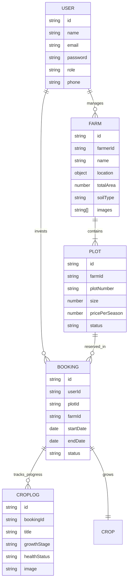

# 🖥️ Dhara Backend Service

This service handles the core business logic, database management, and authentication for the Dhara platform.

## 🗄️ Database Architecture (ER Diagram)

Below is the Entity-Relationship diagram showing how our data is structured in MongoDB.

## 🚀 Key Modules
- **Auth Module:** JWT-based authentication and Google OAuth 2.0.
- **Farm Module:** Management of farm listings and plot availability.
- **Booking Engine:** Handles the reservation logic between investors and plots.
- **Cloudinary Integration:** Specialized middleware for efficient image storage and automatic cleanup.

## 🛠 Tech Stack
- Node.js & Express
- MongoDB (Mongoose)
- Multer (File Uploads)
- Cloudinary (CDN)
