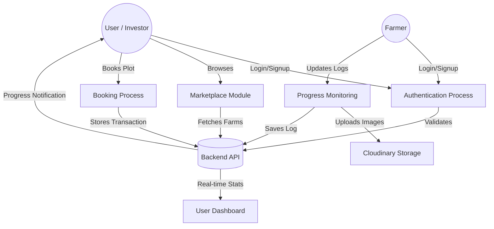

# 🎨 Dhara Frontend Application

A premium, highly interactive React application built for the Dhara fractional farming platform.

## 🔄 Data Flow Diagram (DFD)

This diagram represents how data flows between the user, the application, and the backend services.

## 🌟 Visual Features
- **Glassmorphic UI:** Modern, transparent card designs.
- **Scroll Animations:** Powered by `framer-motion` for a premium feel.
- **Interactive Forms:** Multi-step booking and crop selection process.
- **Dynamic Dashboards:** Separate views for Investors (impact tracking) and Farmers (management).

## 🛠 Tech Stack
- React.js (Vite)
- Tailwind CSS
- Framer Motion (Animations)
- Axios (API Communication)
- React Toastify (Notifications)
